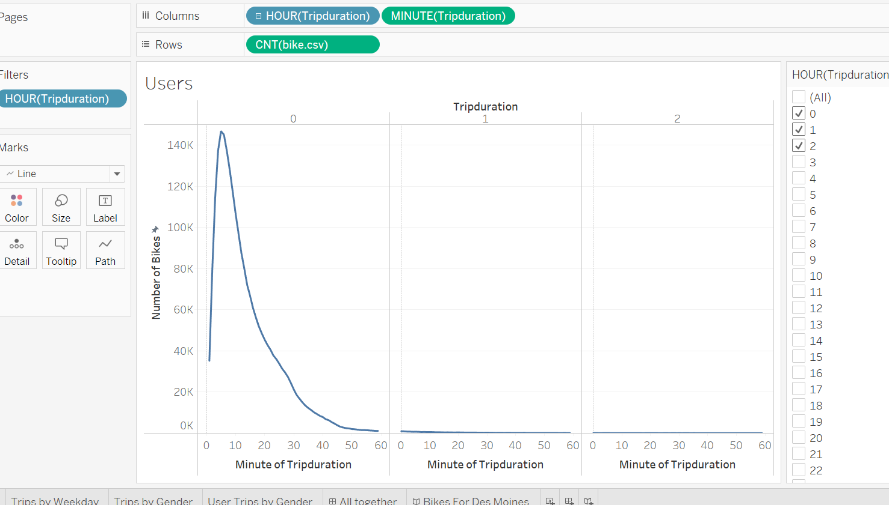

# bikesharing
## Overview of the analysis
We are munipulating data and presenting in a tabluea format/story so investors will invest in a bike program in Des Moines Iowa.
## Results
1. This is a graph of Checkout Times for Users  
 
We can see from the graph the bikes are most used for very small durations. Which would quick remotes.  
2. This is a graph of Checkout Times by Gender  
 
We can see the male population ride the bikes the most.   
3. This is a graph of Trips by Weekday for Each Hour  
 
We can see the bike are used early in the morning from 7AM to 9AM and 4PM to 7PM.  
4. This is a graph of Trips by Gender  
 
This graph shows similar results from the number 2 graph that men ride more. Also it matches number 4 graph on when bikes are used.  
5. This is a graph of User Trips by Gender by Weekday  
 
We can see from the graph most of the bike users are subscribers rather than customers.  
6. This is a graph of Bike Repairs  
 
This shows how many of the bike need repairs.
7. This is a graph of Bike Utilization  
 
This shows how many of the bikes get used. They seem to be used evenly across the board.  
# Story 
 
This give a side by side representation of the graphs 1, 2, 4, 5

## Summary
The results show that this would be a good investment. Des Moines has a great small town presence. This bikes will allow people to make the small trips for in city activites.
Two visualiztions I would suggest are:
1. Look into see what ages were riding the bikes
2. Track what stores or facilites the bikers visited the most. 
 
[link to my tableau dashboard](https://public.tableau.com/app/profile/brian.scherping/viz/ChallengeProblem/UserTripsbyGender?publish=yes)
